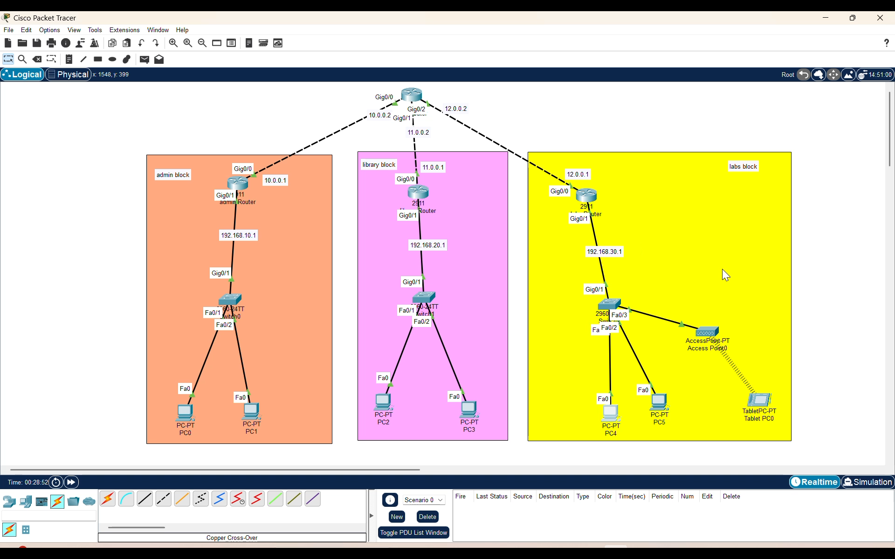
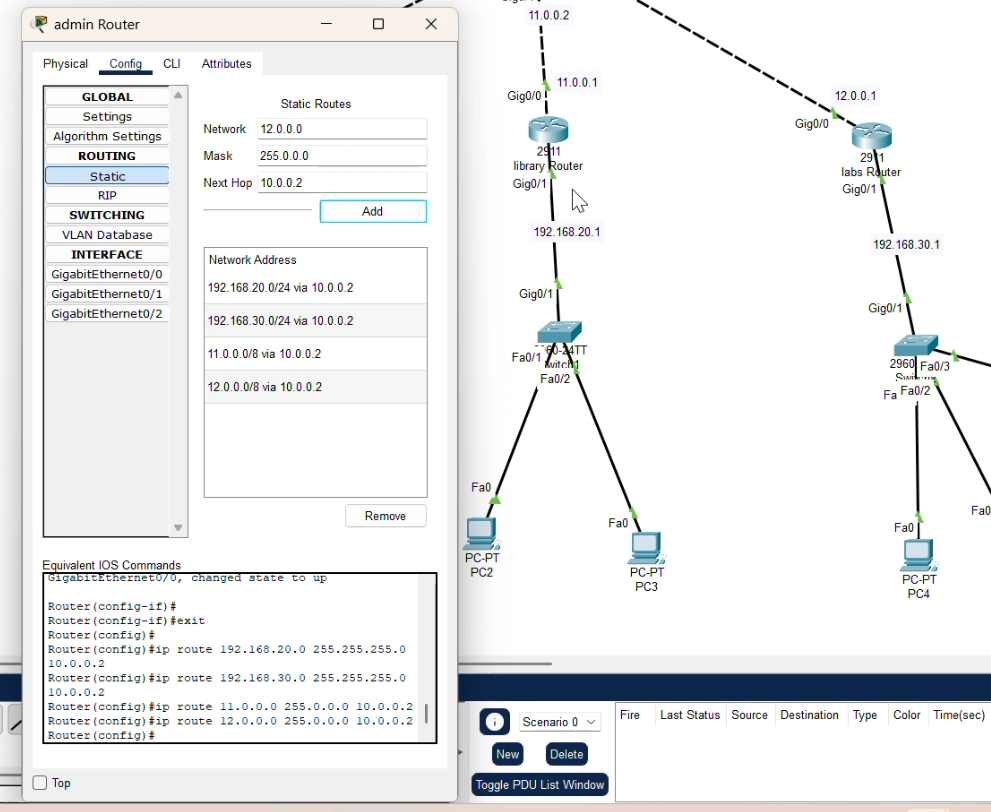
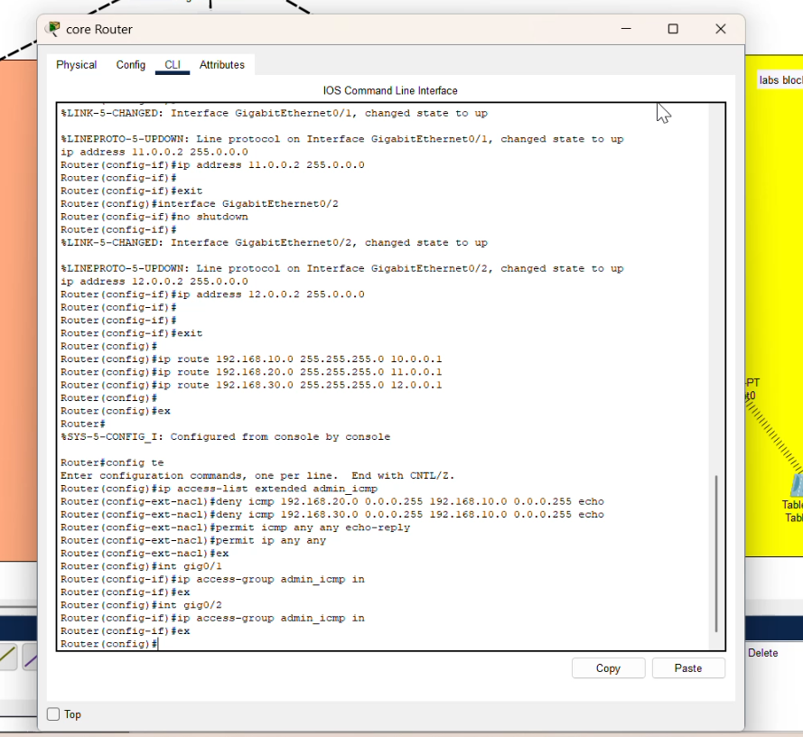
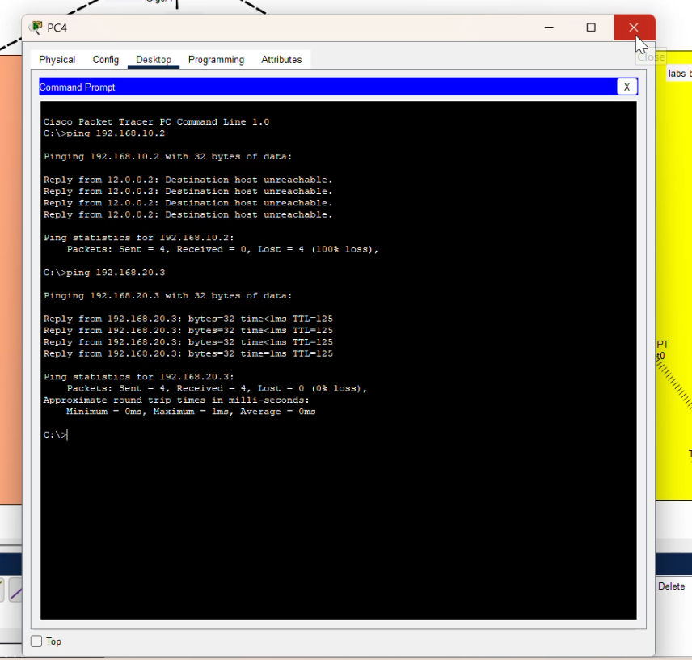
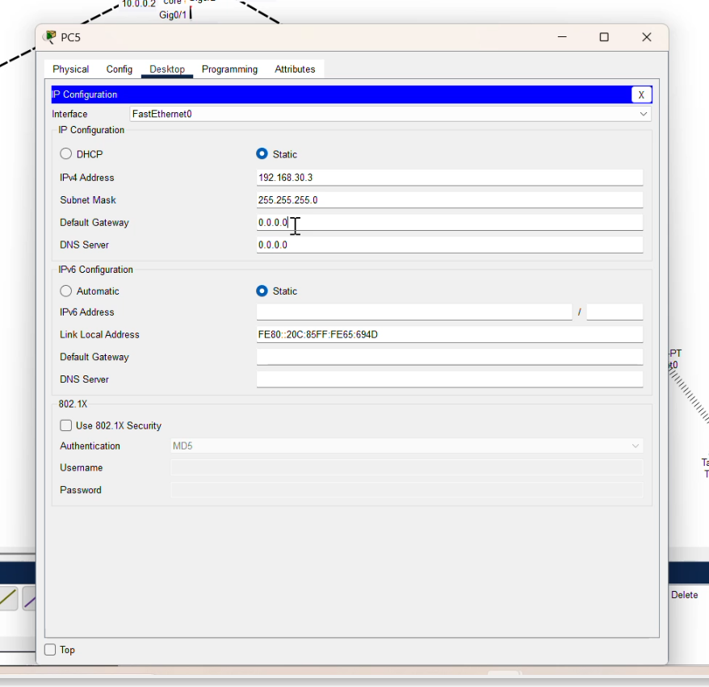

# Campus Network Design – SJ Engineering College

## 📌 Project Overview

This project involved designing and simulating a campus network infrastructure for SJ Engineering College (Client: Brayden) using Cisco Packet Tracer. The network connected multiple buildings including Administration, Library, and Laboratories with secure and efficient communication using VLANs, routing, and network security configurations.

---

## 👨‍💻 Role

Network Engineer

## ⏱ Duration

3 Months

## 🏢 Client

SJ Engineering College (Client: Brayden)

---

## 🛠️ Technologies Used

* Cisco Packet Tracer
* VLAN
* VLSM Subnetting
* Access Control Lists (ACL)
* Spanning Tree Protocol (STP)
* SNMP Monitoring
* Routing and Switching

---

## 🧠 Network Architecture

Multiple Buildings → Core Switch → Distribution Switch → Access Switch → End Devices
VLAN Segmentation for Departments
Routing Between VLANs
Network Monitoring using SNMP

---

## ⚙️ Implementation Steps

1. Designed network topology connecting multiple campus buildings.
2. Implemented VLAN segmentation for different departments.
3. Applied VLSM subnetting for efficient IP address allocation.
4. Configured inter-VLAN routing for communication between departments.
5. Implemented Access Control Lists for network security.
6. Enabled Spanning Tree Protocol to prevent switching loops.
7. Configured SNMP for network monitoring.
8. Tested connectivity and network performance.

---

## 🚀 Key Features

* VLAN based network segmentation
* Efficient IP allocation using VLSM
* Inter-VLAN routing
* Network security using ACL
* Loop prevention using STP
* Network monitoring using SNMP
* Scalable campus network design

---

## 🎯 Outcome

Successfully designed and simulated a secure and scalable campus network infrastructure ensuring efficient communication, network security, and reliable connectivity between departments.

---

## 📁 Folder Structure

Campus-Network-Design/
│
├── README.md
├── topology/
├── screenshots/

---

## 📸 Network Topology

  

---

## 📸 Configuration Screenshots

## Static Routing

  

## ACL configuration 

  

## Ping Test 

  

## IP Configuration 

  

---

## 📄 Configuration Files
Router configuration files are available in the `configs` folder including static routing configuration, ACL configuration, and IP addressing details.
